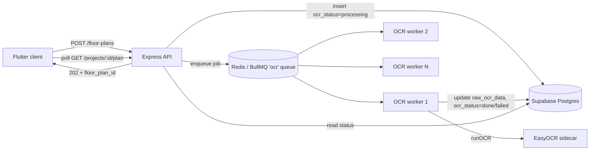

# OCR Scalability Architecture

## Problem (before)
OCR ran **synchronously inside the upload request**, and the EasyOCR service
serialized all jobs **globally**. With many tenants, request B waited behind
request A's multi-second OCR while holding an HTTP connection open — it does not
scale to thousands of users and risks request timeouts / connection exhaustion.

## Solution (after) — async queue + worker pool
Uploads return **202 Accepted** immediately; OCR runs on a horizontally-scaled
worker pool backed by Redis (BullMQ). The client polls the plan endpoint for
status. Enabled with `OCR_ASYNC=true` + `REDIS_URL` (off by default → no
behavior change until you flip it and start the worker).



```
                 ┌──────────────┐
  upload ───────▶│  Express API │──insert(processing)──▶ Postgres
                 │              │──enqueue──▶ Redis(BullMQ)
                 │   202 ◀──────│                 │
                 └──────────────┘                 │  (N workers, concurrency C)
                                          ┌────────┴────────┐
                                          ▼                 ▼
                                    ocrWorker.js ...   ocrWorker.js
                                          │ runOCR → EasyOCR sidecar
                                          ▼
                                   update floor_plans(done|failed)
  client polls /plan ◀────────────────────┘
```

## Reliability
- **Retries:** 3 attempts with exponential backoff (5s base) per job.
- **Failure recovery:** after final failure the worker sets `ocr_status="failed"`
  so the UI can show an error / offer re-upload (instead of a stuck "processing").
- **Back-pressure:** Redis absorbs spikes; add workers (`instances` in
  `ecosystem.config.js`) to raise throughput linearly.
- **Idempotency:** jobs carry `floor_plan_id`; re-processing overwrites the same row.

## Capacity sizing (rule of thumb)
`throughput ≈ workers × concurrency / avg_ocr_seconds`. e.g. 4 workers ×
concurrency 2 ÷ 6s ≈ **1.3 plans/sec ≈ 4,800/hour**. Scale workers to the
target; Redis and Postgres are not the bottleneck at this range.

## Enabling in production
1. Provision Redis (managed or `redis-server`); set `REDIS_URL`.
2. Set `OCR_ASYNC=true` on the API and worker.
3. `pm2 start ecosystem.config.js --only archiquant-ocr-worker` (scale `instances`).
4. Frontend already polls `GET /projects/:id/plan`; ensure the upload UI treats a
   202 as "processing" and polls until `ocr_status` is `done`/`failed`.

> Follow-up (tracked): the synchronous path also builds `structural_elements`
> inline. The worker currently persists `raw_ocr_data`; port the
> structural-element build into the worker for full parity before making async
> the default.
